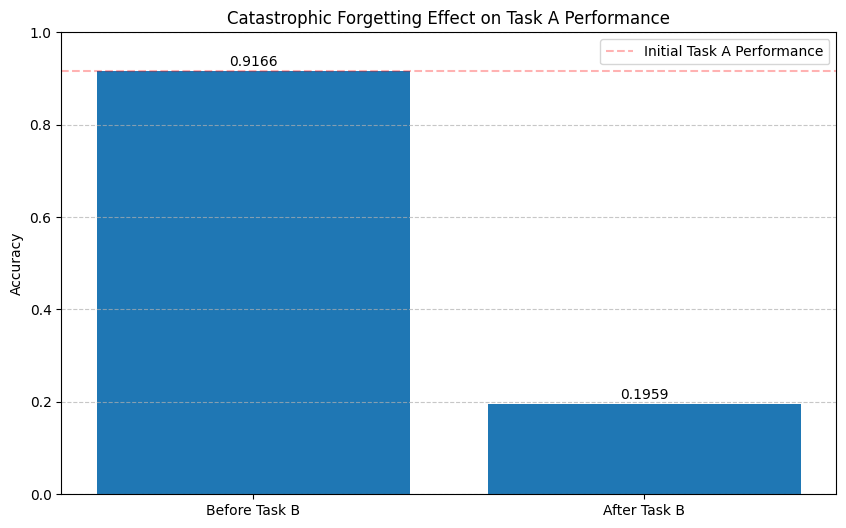

# Elastic Graph Learning in IDS

This repository contains the code for the paper "Continual Learning Enhances for Graph-based IDS".

## Requirements

- Python 
- PyTorch 
- DGL 
- PyG 
- PyTorch Geometric 
- PyTorch Lightning 
- PyTorch Geometric Temporal

## Notebooks

- `notebooks/experiments/cataEGS/CatastrophicEGS.ipynb`: This notebook contains the code for the catastrophic forgetting experiment.

## Daily Work

- 05/01/2025: Catastrophic EGS
  - Result: 
  

